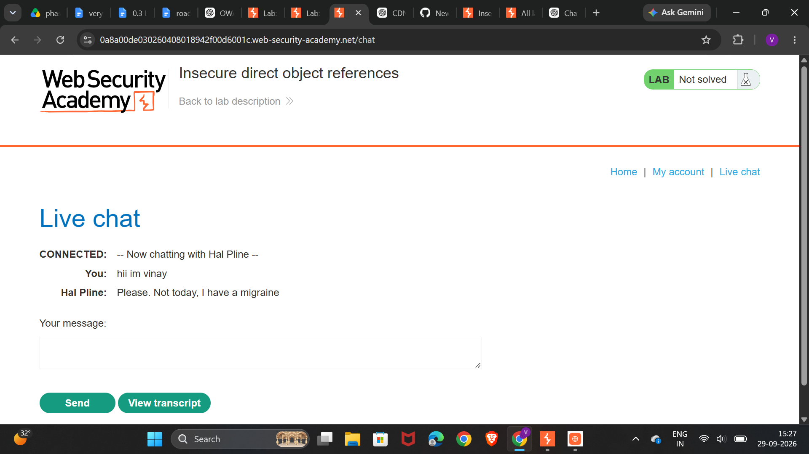
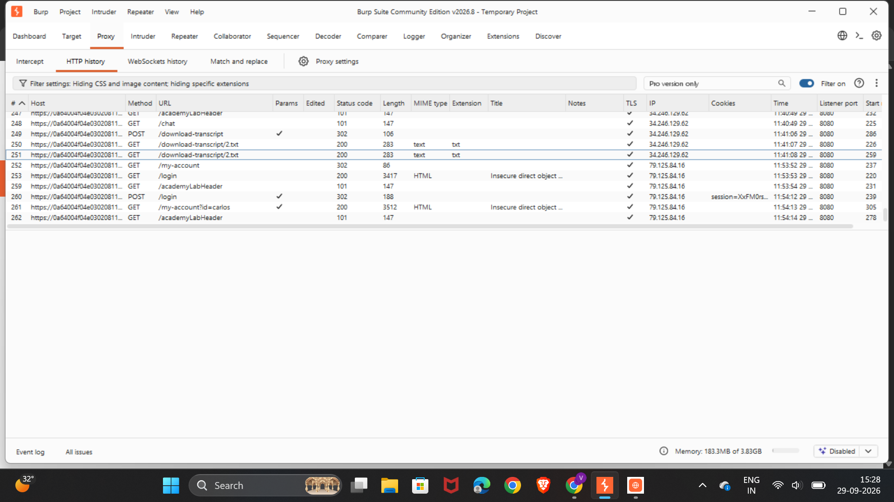
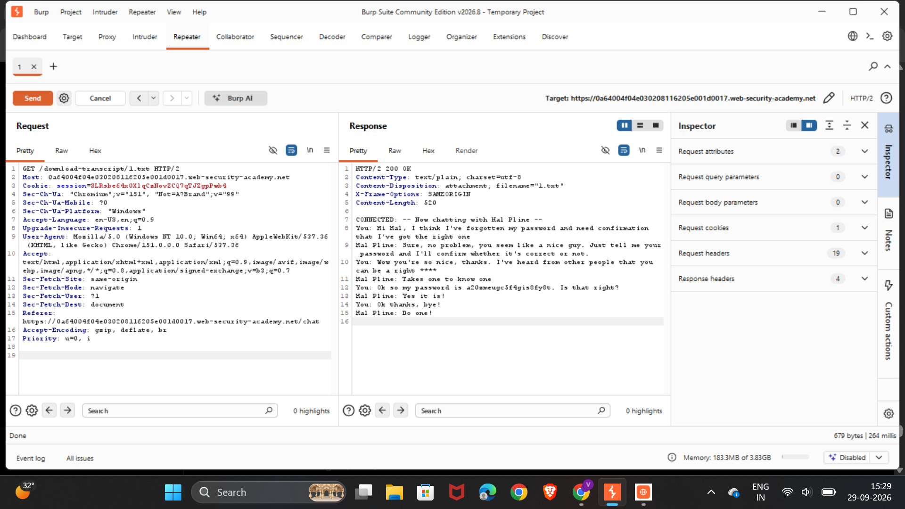
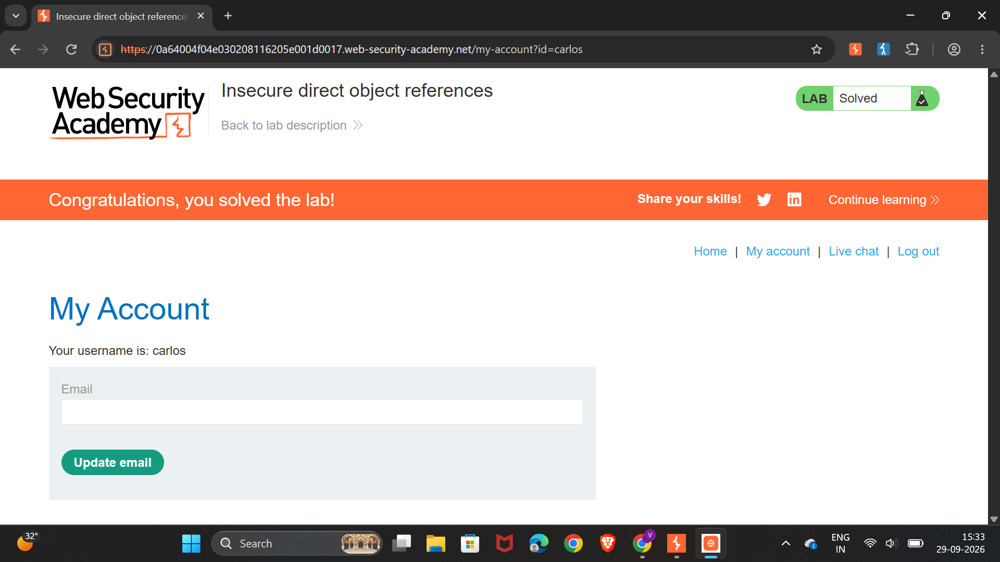

# IDOR — Insecure Direct Object References

## Lab Information

| Field | Details |
|---|---|
| Platform | PortSwigger Web Security Academy |
| Vulnerability | Insecure Direct Object References (IDOR) |
| Category | Broken Access Control |
| Difficulty | Apprentice |
| Status | ✅ Solved |

---

## 1. What is IDOR?

Insecure Direct Object Reference (IDOR) is an access control vulnerability that occurs when an application uses a user-controlled identifier to access an object without properly checking whether the authenticated user is authorized to access that object.

For example:

```http
GET /download-transcript/2.txt
```

If changing the identifier to:

```http
GET /download-transcript/1.txt
```

allows a user to access another user's transcript, the application has an access control vulnerability.

---

## 2. Lab Scenario

The application contains a live chat feature where users can view and download chat transcripts.

After using the chat functionality, Burp Suite captured the following request:

```http
GET /download-transcript/2.txt HTTP/2
```

The `2.txt` portion acts as a direct reference to a transcript.

### Initial Chat



---

## 3. Testing Methodology

### Step 1 — Capture the Request

The request was captured using:

**Browser → Burp Proxy → HTTP History**

The relevant request was:

```http
GET /download-transcript/2.txt HTTP/2
```

### Step 2 — Send the Request to Repeater

The request was sent to Burp Suite Repeater.

The original request was sent first to establish a baseline response.

### Step 3 — Modify the Object Reference

The original request referenced:

```http
/download-transcript/2.txt
```

The object identifier was modified to:

```http
/download-transcript/1.txt
```

No other part of the request was changed.

### Original Request



### Modified Request



### Step 4 — Analyze the Response

The modified request returned:

```http
HTTP/2 200 OK
```

The response contained a different user's transcript.

This demonstrated that the server did not properly verify whether the authenticated user was authorized to access transcript `1.txt`.

---

## 4. Vulnerability

The application trusted a user-controlled object reference:

```text
/download-transcript/1.txt
                    ↑
              Object reference
```

The server returned the requested transcript without verifying ownership.

The attack flow was:

```text
Authenticated User
        ↓
Requests transcript 1
        ↓
Server does not verify ownership
        ↓
Another user's transcript returned
```

This is an example of IDOR resulting in horizontal privilege escalation.

---

## 5. Impact

The unauthorized transcript contained sensitive information.

This demonstrates that an attacker could potentially access resources belonging to other users by modifying object identifiers.

Depending on the application, IDOR vulnerabilities can expose:

- Personal information
- Private messages
- Documents
- Orders
- Account information
- Sensitive files
- Credentials

---

## 6. Root Cause

The root cause is insufficient server-side authorization.

The vulnerable logic is conceptually similar to:

```javascript
const transcript = getTranscript(req.params.id);

return transcript;
```

The application retrieves the requested object but does not verify whether the authenticated user is authorized to access it.

---

## 7. Secure Implementation

The server should verify ownership or authorization before returning the resource.

For example:

```javascript
const transcript = await getTranscript(req.params.id);

if (transcript.ownerId !== req.user.id) {
    return res.status(403).json({
        message: "Forbidden"
    });
}

return res.send(transcript);
```

The important authorization flow is:

```text
Requested Resource
        ↓
Check Ownership
        ↓
Check Authorization
        ↓
Authorized?
   ↓           ↓
 YES          NO
  ↓            ↓
Return      403 Forbidden
Resource
```

---

## 8. Authentication vs Authorization

This lab demonstrates an important distinction:

```text
Authentication
      ↓
"Who are you?"

Authorization
      ↓
"Are you allowed to access THIS resource?"
```

A user being authenticated does not mean they are authorized to access every resource.

---

## 9. Burp Suite Workflow

```text
Browser
   ↓
Burp Proxy
   ↓
HTTP History
   ↓
Identify Object Reference
   ↓
Send to Repeater
   ↓
Modify Object Identifier
   ↓
Send Request
   ↓
Analyze Response
   ↓
Determine Whether Authorization Is Enforced
```

---

## 10. Evidence

The following screenshots document the testing process:

### 1. Initial Chat


### 2. Original Transcript Request


### 3. Modified Transcript Request


### 4. Carlos Account



These screenshots show the progression from interacting with the application, capturing the original request, modifying the object reference, and confirming unauthorized access.

---

## 11. Key Takeaway

The important lesson is not simply:

> Change `2` to `1`.

The actual security lesson is:

> An application must perform server-side authorization checks for every object requested by a user.

A user-controlled identifier combined with a missing authorization check can result in IDOR and Broken Access Control.

---

## Tools Used

- Burp Suite
- Proxy
- HTTP History
- Repeater
- PortSwigger Web Security Academy

---

## Lab Status

**✅ Solved**
