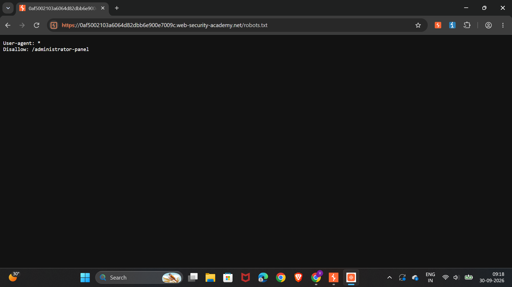
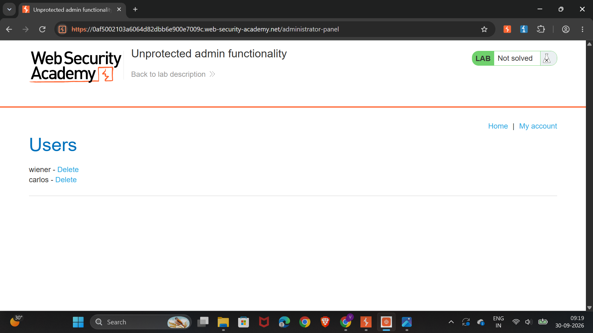
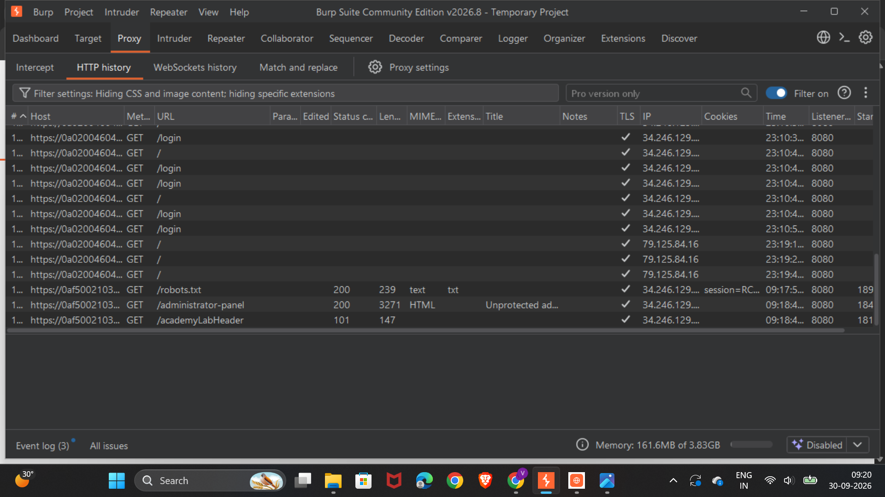
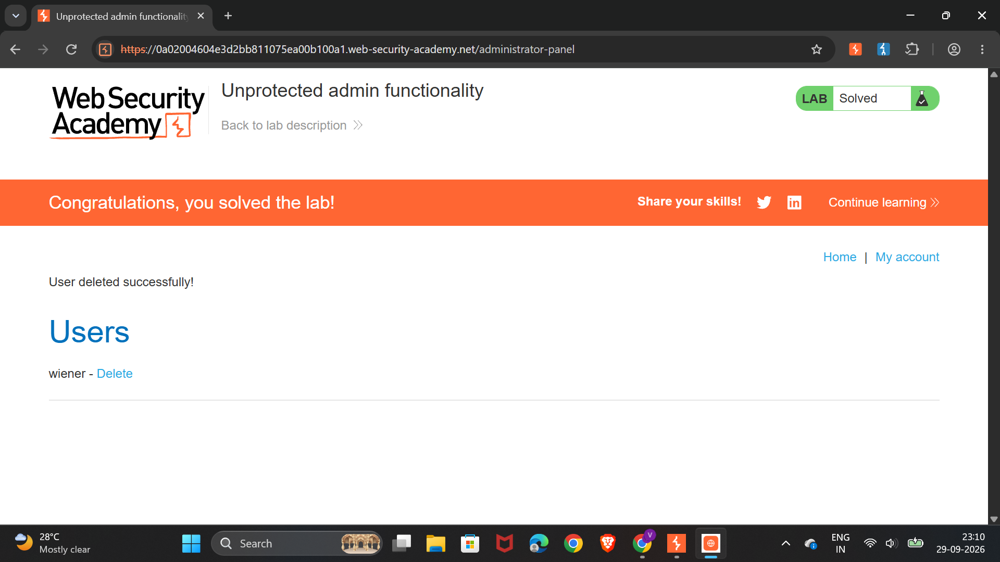

# Unprotected Admin Functionality

## Lab Information

| Field | Details |
|---|---|
| Platform | PortSwigger Web Security Academy |
| Vulnerability | Unprotected Admin Functionality |
| Category | Broken Access Control |
| Difficulty | Apprentice |
| Status | ✅ Solved |

---

## 1. What is Unprotected Admin Functionality?

Unprotected Admin Functionality is a Broken Access Control vulnerability where sensitive administrative functionality is accessible to users who should not have permission to access it.

An application may expose an administrative endpoint without properly enforcing authorization.

For example:

```text
/administrator-panel
```

---

## 2. Lab Scenario

The application contains an administrative panel that should not be accessible to normal users.

The objective of the lab was to discover the hidden administrator endpoint and access the admin functionality.

---

## 3. Testing Methodology

### Step 1 — Inspect `robots.txt`

The application's `robots.txt` file was inspected.

It contained:

```text
User-agent: *
Disallow: /administrator-panel
```

The `Disallow` entry revealed the hidden administrator endpoint:

```text
/administrator-panel
```

### Evidence



---

### Step 2 — Access the Administrator Panel

The discovered endpoint was accessed:

```text
/administrator-panel
```

The administrator panel was accessible without proper authorization.

### Evidence



---

### Step 3 — Analyze the Request Using Burp Suite

Burp Suite was used to intercept and inspect the request to the administrator panel.

The request confirmed that the administrative functionality was accessible directly through the discovered endpoint.

### Evidence



---

### Step 4 — Complete the Lab

The exposed administrative functionality was used to complete the required lab objective.

The lab was successfully solved.

### Evidence



---

## 4. Vulnerability

The application exposed sensitive administrative functionality through a discoverable endpoint:

```text
/administrator-panel
```

The server failed to properly enforce authorization before allowing access to the administrative functionality.

This resulted in unauthorized access to functionality intended for administrators.

---

## 5. Root Cause

The root cause is insufficient server-side access control.

The application relied on the administrator endpoint being hidden rather than properly enforcing authorization.

This is an important security principle:

> Hiding an endpoint is not a security control.

Administrative functionality must be protected using proper server-side authorization checks.

---

## 6. Impact

If an administrative panel is accessible to unauthorized users, an attacker may be able to perform privileged actions such as:

- Delete users
- Modify user accounts
- Change application settings
- Access sensitive information
- Perform administrative operations

The actual impact depends on the functionality exposed by the application.

---

## 7. Authentication vs Authorization

This lab demonstrates the difference between authentication and authorization.

**Authentication**

> Who are you?

**Authorization**

> Are you allowed to perform this action?

A user may be successfully authenticated but still must not be allowed to access administrative functionality.

---

## 8. Burp Suite Workflow

```text
Browser
   ↓
Burp Proxy
   ↓
HTTP History
   ↓
Identify Administrative Endpoint
   ↓
Inspect Request
   ↓
Analyze Access Control
   ↓
Verify Unauthorized Access
```

---

## 9. Key Takeaway

The important lesson from this lab is:

> Sensitive administrative functionality must be protected by server-side authorization controls.

`robots.txt` is intended to provide instructions to web crawlers, not to protect sensitive resources.

If an administrative endpoint is revealed through `robots.txt`, source code, predictable URLs, or other information disclosure, the application must still prevent unauthorized access through proper authorization checks.

---

## Tools Used

- Burp Suite
- Proxy
- HTTP History
- Browser
- PortSwigger Web Security Academy

---

## Lab Status

**✅ Solved**
