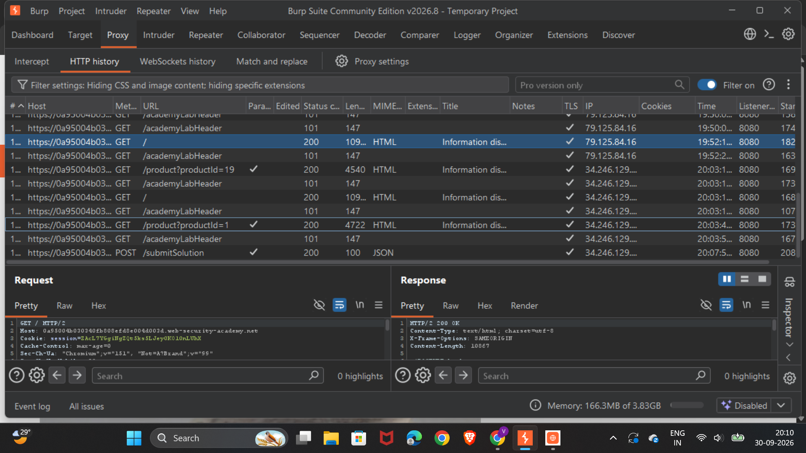
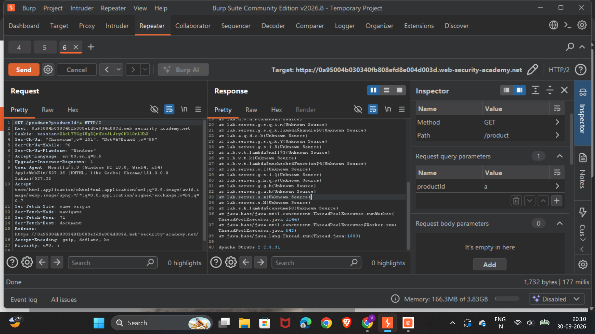

# Information Disclosure in Error Messages

## Lab Information

- **Category:** Cryptographic Failures
- **OWASP Top 10:** A04 — Cryptographic Failures
- **Lab Type:** Information Disclosure
- **Platform:** PortSwigger Web Security Academy
- **Testing Tool:** Burp Suite
- **Severity:** Low to Medium

---

## 1. Objective

The objective of this lab was to identify information disclosure caused by overly detailed error messages.

The application returned an error response containing information about its internal implementation.

The goal was to:

1. Intercept a request using Burp Suite.
2. Trigger an error condition.
3. Analyze the server's error response.
4. Identify the information being disclosed.
5. Understand the security impact.
6. Complete the lab successfully.

---

## 2. Vulnerability Overview

### What is Information Disclosure?

Information disclosure occurs when an application unintentionally reveals sensitive or internal information to a user.

Examples include:

- Software or framework versions
- Internal file paths
- Stack traces
- Database information
- Server configuration
- Debug information
- Internal class or method names
- Internal IP addresses
- Technology stack details

Detailed error messages are a common source of information disclosure.

Applications should return generic error messages to users while keeping detailed debugging information in secure server-side logs.

---

## 3. Testing Methodology

The testing process followed these steps:

```text
Application
    ↓
Intercept Request
    ↓
Burp Suite Proxy
    ↓
Trigger Invalid Request
    ↓
Send Request
    ↓
Analyze Error Response
    ↓
Identify Information Disclosure
```

---

## 4. Step 1 — Intercept the Request

Burp Suite was used as an intermediary between the browser and the target application.

The request was intercepted using the Proxy feature.



The intercepted request provided a starting point for testing how the application handled unexpected or invalid input.

---

## 5. Step 2 — Trigger an Error

The request was manipulated in order to cause the application to process an unexpected condition.

Instead of returning only a generic error message, the application generated a detailed error response.

This behavior is important from a security perspective because error responses can expose implementation details that are normally hidden from users.

---

## 6. Step 3 — Analyze the Error Response

The resulting response was inspected in Burp Suite.



The error response demonstrated that the application was disclosing internal implementation information through its error handling.

This type of information can help an attacker understand the technologies and components used by the application.

---

## 7. Why This Is a Security Issue

Detailed error messages can provide attackers with useful reconnaissance information.

For example:

```text
Application
    ↓
Technology Stack
    ↓
Framework / Library
    ↓
Version Information
    ↓
Potentially Vulnerable Component
```

If a specific framework or software version is exposed, an attacker can search for known vulnerabilities affecting that version.

Therefore, even when the disclosed information does not directly provide unauthorized access, it can make further attacks easier.

---

## 8. Impact

The primary impact of this vulnerability is information leakage.

Potential consequences include:

### 1. Technology Fingerprinting

An attacker may identify technologies used by the application.

### 2. Version Enumeration

If software version information is exposed, attackers can determine whether the application is running an outdated component.

### 3. Improved Reconnaissance

The disclosed information can be combined with other reconnaissance techniques to build a more accurate picture of the target.

### 4. Vulnerability Identification

Known vulnerabilities can be searched based on the disclosed framework, library, or version.

### 5. Attack Chaining

Information disclosure may not be sufficient to compromise an application by itself, but it can assist other attacks.

---

## 9. Root Cause

The root cause is overly detailed error handling.

The application exposes internal error information directly to the client instead of returning a generic error response.

### Insecure Design

```text
User Request
    ↓
Application Error
    ↓
Detailed Internal Error
    ↓
Returned to User
```

### Secure Design

```text
User Request
    ↓
Application Error
    ↓
Generic Error → User

Detailed Error
    ↓
Secure Server-Side Logs
```

The user should receive only the information necessary to understand that the request failed.

---

## 10. Secure Implementation

Applications should avoid exposing internal implementation details through production error messages.

### Insecure

```text
Internal framework exception
Framework version: X.X.X
Internal path: /server/application/...
Stack trace: ...
```

### Secure

```text
An unexpected error occurred.
Please try again later.
```

Detailed technical information should instead be recorded in protected server-side logs.

---

## 11. Recommended Remediation

### 1. Use Generic Error Messages

Return generic messages to external users.

Example:

```text
Something went wrong. Please try again later.
```

### 2. Disable Debug Mode in Production

Debug mode should not be enabled in production environments.

Development environments may expose detailed stack traces for debugging, but production systems should suppress them.

### 3. Log Detailed Errors Server-Side

Detailed information should be stored in secure application logs.

Logs may contain:

- Stack traces
- Exception details
- Request identifiers
- Internal component information
- Debugging information

Access to these logs should be restricted.

### 4. Avoid Exposing Software Versions

Applications should avoid unnecessarily revealing framework and software version information.

### 5. Implement Centralized Error Handling

A centralized error-handling mechanism can ensure that unexpected exceptions are converted into safe responses.

```text
Application Error
       ↓
Central Error Handler
       ↓
   ┌───────────────┐
   │               │
   ↓               ↓
 User          Server Log
   ↓               ↓
Generic        Detailed
Response       Error
```

---

## 12. Testing Result

The application was successfully tested for information disclosure through error handling.

The testing demonstrated that:

- A request could be intercepted using Burp Suite.
- An error condition could be triggered.
- The application returned a detailed error response.
- Internal implementation information was exposed.
- The information could assist an attacker during reconnaissance.
- The lab was successfully completed.


---

## 13. Evidence

All screenshots captured during the testing process are stored in the `screenshots` directory.

```text
screenshots/
├── 01-proxy-request.png
├── 02-error-response.png
└── 03-lab-solved.png
```

### Evidence 1 — Proxy Request

The following screenshot shows the intercepted HTTP request in Burp Suite.


### Evidence 2 — Error Response

The following screenshot shows the application's response after triggering the error condition.


### Evidence 3 — Lab Solved

The following screenshot shows successful completion of the PortSwigger lab.


---

## 14. Key Security Lessons

### Lesson 1 — Error Messages Are Part of the Attack Surface

Error handling should be considered during security testing.

### Lesson 2 — Debug Information Should Not Reach Users

Detailed debugging information belongs in protected server-side logs.

### Lesson 3 — Information Disclosure Can Enable Other Attacks

A vulnerability does not always need to provide direct access to be useful to an attacker.

Information obtained during reconnaissance can be combined with other vulnerabilities.

### Lesson 4 — Production and Development Error Handling Should Be Different

Development:

```text
Detailed Errors
      ↓
   Developer
```

Production:

```text
Generic Error
      ↓
     User

Detailed Error
      ↓
Secure Server Logs
```

---

## 15. Skills Practiced

Through this lab, I practiced:

- Burp Suite Proxy
- HTTP request interception
- Request manipulation
- Error-response analysis
- Information disclosure testing
- Application reconnaissance
- Security impact analysis
- Root-cause analysis
- Secure error handling
- Security remediation

---

## 16. Conclusion

This lab demonstrated how seemingly harmless error messages can leak useful internal information.

The vulnerability occurs when an application exposes detailed implementation or debugging information directly to users.

From an AppSec perspective, secure error handling should follow the principle:

> Give users only the information they need, while keeping detailed technical information in secure server-side logs.

This reduces unnecessary information leakage and makes reconnaissance more difficult for attackers.

---

## 17. Lab Completion

- **Status:** Completed
- **Lab:** Information Disclosure in Error Messages
- **Category:** Cryptographic Failures
- **Tool Used:** Burp Suite
- **Platform:** PortSwigger Web Security Academy
